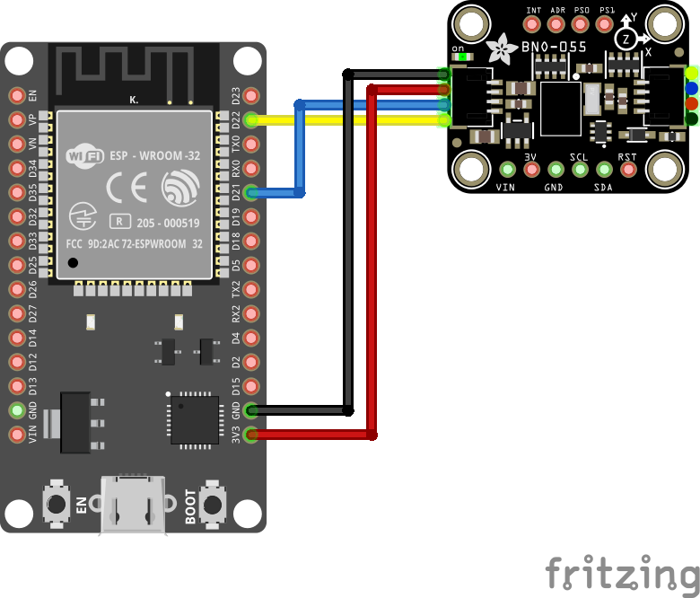

# Telescope-Orientation Syncronisation to Stellarium

Synchronize you telescope's current orientation into [Stellarium](http://stellarium.org/) where you can keep track what you are looking at in real-time and find objects much easier.

This readme will be my notebook during development and should provide detailled instructions to replicate the setup once it's finished.

## Introduction

To achieve the goal of finding an object in the sky more easily, we need to link the telescope's current orientation to a star chart where we can compare the current orientation with the orientation needed to view a specific object within the ocular.

As most objects that need to be located with this method will be very dim and dificult to spot, we need to center the object in the ocular view with a certain precision.

My requirement is, that an object appears near the center of my 8mm ocular that has a FOV of 0.45° (f=1200mm). This means an overall deviation of 0.2° compared to the real position is acceptable.

## Calculations

see [jupyter-notebook](docs/calculations.ipynb)

## Determining telescope orientation

Can be done using a high quality motion sensor (accelerometer, gyroscope and compass) or rotary encoder mounted on top of the two axes of rotation (az/alt). To avoid additional mechanical work, I chose the motion sensor approach.

After some research I selected the following list of possible candidates:

Rank | Name | Pros | Cons
---|---|---|---
1 | [BNO085](https://learn.adafruit.com/adafruit-9-dof-orientation-imu-fusion-breakout-bno085/) | Integrated Sensor Fusion | Out of Stock
2 | [BNO055](https://learn.adafruit.com/adafruit-bno055-absolute-orientation-sensor/overview) |  Integrated Sensor Fusion | Calibration is cumbersome and is lost frequently
3 | [LSM6DSOX + LIS3MDL](https://github.com/adafruit/Adafruit-LSM6DSOX-LIS3MDL-PCB) |  | Out of Stock
4 | [LSM6DS33 + LIS3MDL](https://github.com/adafruit/Adafruit-LSM6DS33-LIS3MDL-PCB) | | 
5 | [NXP 9-DOF](https://learn.adafruit.com/nxp-precision-9dof-breakout) |  | Out of Stock
6 | [ICM-20948](https://learn.adafruit.com/adafruit-tdk-invensense-icm-20948-9-dof-imu) | ok-ish Zero-rate Offset | 
7 | MPU-9250 | | High Zero-rate Offset

Stellarium expects the right ascension and declination of the telescope as input. To compute these values, we need the exact location and a timestamp. A simple GPS Receiver ([GP-20U7](http://www.adh-tech.com.tw/?50,gp-20u7)) should provide this information with sufficient precision.

## Hardware Setup

Either [ESP8266](http://esp8266.net/) or [ESP32](http://esp32.net/) where the ESP32 provides additional Bluetooth capabilities.

### Wire diagram

## Interfacing with Stellarium

Bluetooth or Wifi.

Can either be done using the [Remote Control Plug-in](http://stellarium.org/doc/head/remoteControlDoc.html) or the [Telescope Control plug-in](http://stellarium.sourceforge.net/wiki/index.php/Telescope_Control_plug-in).

Messaging via the [Stellarium Telescope Protocol](http://svn.code.sf.net/p/stellarium/code/trunk/telescope_server/stellarium_telescope_protocol.txt):

Name | Offset (Bytes) | Length (Bytes) | Type | content
---|---|---|---|---
LENGTH | 0 | 2 | int16 | length of the message including the LENGTH field
TYPE | 2 | 2 | int16 | always 0
TIME | 4 | 8 | int64 | server timestamp in microseconds since epoch
RA | 12 | 4 | int32 | right ascension of the telescope (J2000); 0x0 = 0h = 24h; 0x80000000 = 12h
DEC | 16 | 4 | int32 | declination of the telescope (J2000); 0x0 = 0°; 0x40000000 = +90°; -0x40000000 = 0xFFFFC0000000 = -90°
STATUS | 20 | 4 | int32 | status of the telescope, currently unused; 0=ok

Byte-order is little-endian. Least significiant bytes are stored first.

see also [TelescopeTCP::telescopeGoto](https://github.com/Stellarium/stellarium/blob/29df37b6c590ed32266f8269fde94bcb95eb5aa1/plugins/TelescopeControl/src/TelescopeClient.cpp#L276)

## LED Codes

The blue LED on the ESP32-Devkit board is used to indicate the following internal states:

LED State | internal State
---|---
off | Application is not running
on | Initialization; Startup
Blink 1Hz | Orientation Sensor not yet calibrated
1x Flash every 5s | All modules running normally
2x Flash every 5s | No GNSS position fix
4x Flash every 5s | Orientation Sensor calibration loss

## References

### Similar Projects

- [Control Your Telescope Using Stellarium & Arduino](https://www.instructables.com/Control-Your-Telescope-Using-Stellarium-Arduino/)
- [Arduino Star-Finder for Telescopes](https://www.instructables.com/Arduino-Star-Finder-for-Telescopes/)
- [SpotNik - StepTo / PushTo / Digital Setting Circles for EQ Mounted Telescopes Based on Arduino](https://www.instructables.com/SpotNik-StepTo-PushTo-Digital-Setting-Circles-for-/)
- [Instrumented Telescope with Raspberry Pi and orientation sensor](https://astrobeano.blogspot.com/2014/01/instrumented-telescope-with-raspberry.html)
- [Telescope pointing based on inertial measurement unit](http://www.doiserbia.nb.rs/Article.aspx?ID=1450-698X1794101V)
- [Accurate Telescope Mount Positioning with MEMS Accelerometers](https://arxiv.org/abs/1407.0035)

### Math

- [Calculating mean and apparent sidereal time](http://www2.arnes.si/~gljsentvid10/sidereal.htm)
- [Data: Converting Alt-Az to RA-Dec – Example](http://jonvoisey.net/blog/2018/07/data-converting-alt-az-to-ra-dec-example/)
- [International Astronomical Union Standards of Fundamental Astronomy](http://www.iausofa.org/)
- [The Astropy Project](https://www.astropy.org/)
- [Astronomical Calculations: Sidereal Time](https://squarewidget.com/astronomical-calculations-sidereal-time/)
- [Sidereal Time Calculator For Any Date, Time and Longitude](http://www.neoprogrammics.com/sidereal_time_calculator/index.php)
- [Local Sidereal Time](https://www.localsiderealtime.com/)
- [Sidereal time calculator](https://astro.subhashbose.com/siderealtime)
- [Converting RA and DEC to ALT and AZ](http://www.stargazing.net/kepler/altaz.html)
- [3D Rotation Converter](https://www.andre-gaschler.com/rotationconverter/)

### Orientation Sensor

- [Bosch Sensortec MEMS BNO055 sensor driver](https://github.com/BoschSensortec/BNO055_driver)
- [AltIMU-AHRS](https://github.com/jremington/AltIMU-AHRS)

### GPS, GNSS, NMEA

- [GPS - NMEA sentence information](http://aprs.gids.nl/nmea/)
- [Common NMEA Sentences](http://www.satsleuth.com/GPS_NMEA_sentences.aspx)

### Hardware

- [Comparing Gyroscope Datasheets](https://learn.adafruit.com/comparing-gyroscope-datasheets)
- [DOIT ESP32 DevKit-v1 (30P)](https://github.com/TronixLab/DOIT_ESP32_DevKit-v1_30P)

### ESP32 Programming

- [How to format strings without the String class](https://cpp4arduino.com/2020/02/07/how-to-format-strings-without-the-string-class.html)

### Stellarium

- [RemoteControl plugin HTTP API description ](http://stellarium.org/doc/head/remoteControlApi.html)
- [Telescope Control plug-in](http://stellarium.sourceforge.net/wiki/index.php/Telescope_Control_plug-in)
- [NexStar Communication Protocol v 1.2](https://www.celestron.com/pages/manuals)

### Astronomy related

- [Light pollution map](https://www.lightpollutionmap.info/)
- [NexStar Resource Site](https://www.nexstarsite.com/index.html)