# Upgrading a Dobsonian-Telescope with Push-To Capabilities

This is about retrofitting a [Dobsonian Telescope](https://en.wikipedia.org/wiki/Dobsonian_telescope) with fancy electronics and means to indicate where the telescope is pointing at, to allow the observer to quickly find an object in the night sky. My motivation was born on a very cold evening shortly after I bought the telescope and I desparately tried to find Uranus in the night sky - and failed.

The resulting setup can, for example, be used with the excellent [Stellarium Plus](https://www.stellarium-labs.com/stellarium-mobile-plus/) App. 

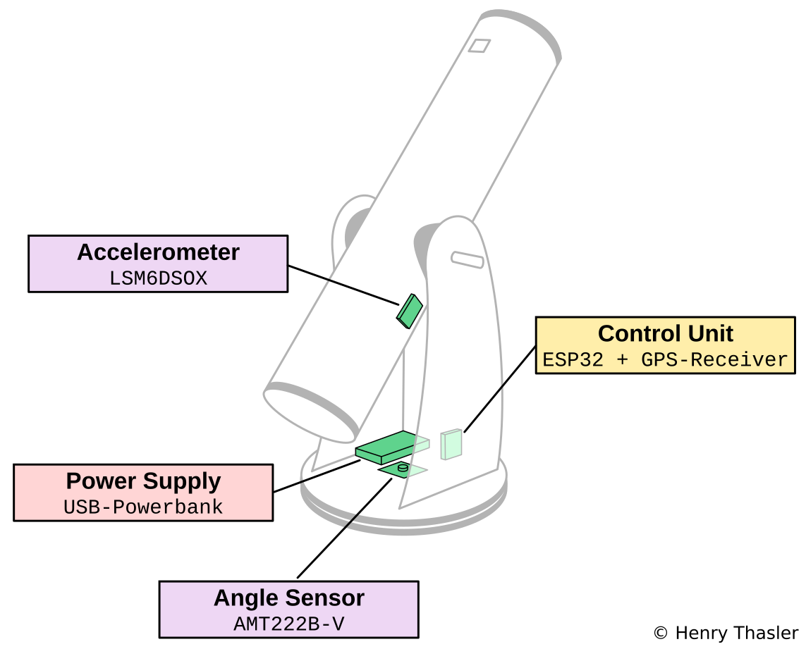

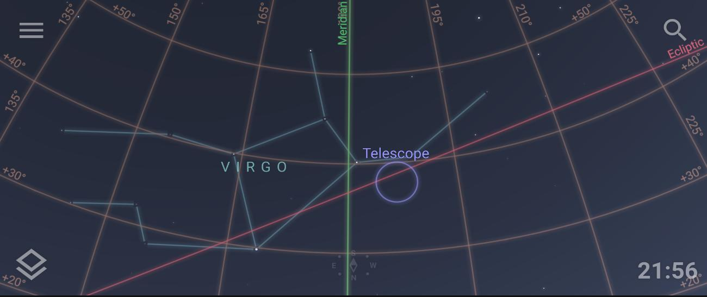

## Quick-Start-Guide

1. Connect power supply.
2. Connect Stellarium Plus via Bluetooth.
3. Wait for GPS location fix.
4. Point the telescope to a known target and set alignment point via Stellarium App.
5. Repeat step 4 to increase alignment precision.

## Introduction

A [Dobsonian Telescope](https://en.wikipedia.org/wiki/Dobsonian_telescope) is a type of telescope that uses an alt-azimuth mounting, which means you can rotate and tilt it. I'm using a [Sky-Watcher 8" Traditional](http://skywatcher.com/product/dob-8-traditional/) but the general method described here can be applied to any Dobsonian.

The term Push-to is generally referred to as a method to indicate (e.g. on a Smartphone-App) where the telescope is pointing at and thus allows to quickly find an object. 

The main design goals are:

1. Precision - I want this setup to be as precise a I can make it with hardware that is available to a hobbyist. 
2. Integration - The solution should integrate with existing astronomy-apps or -software.
3. Simplicity - Setup and installation must match the mobility of a Dobsonian telescope.
4. Wireless - No wires are needed to connect the user interface. Use Wifi or Bluetooth.
5. Ease-of-Use - Anyone should be able to use it with minimal guidance.

## General Concept

To map the current orientation of the telescope to a map of the night sky, we need the following information:

- Date and time
- Location
- Orientation of the telescope

With this information we can transform the orientation of the telescope from a horizontal (alt-azimuth) coordinate system to the equatorial coordinate system that astronomy apps use to indicate the actual position in the night sky where the telescope is pointing at. The critical information with the most influence on the resulting overall precision is the telescope's orientation.

## Overall Design and Result

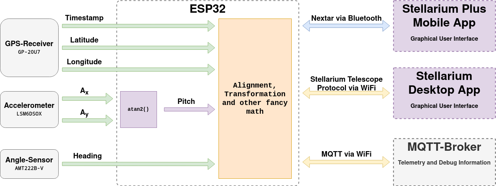

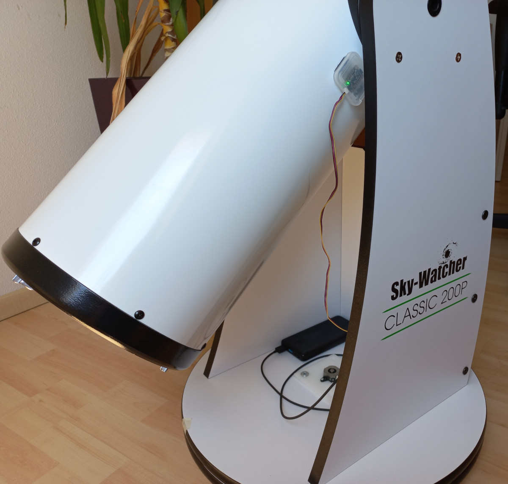 

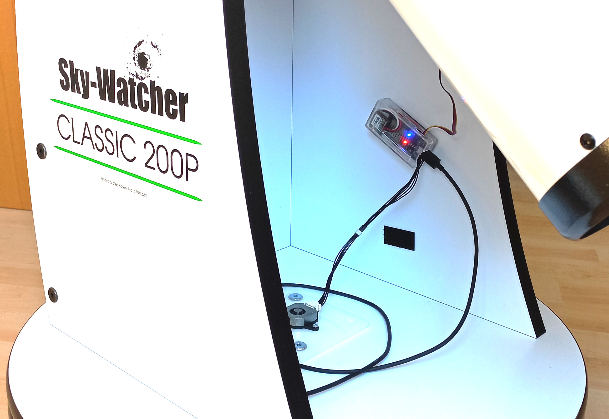

### Stationary precision, noise

Pitch is filtered with 50-samples moving-average:

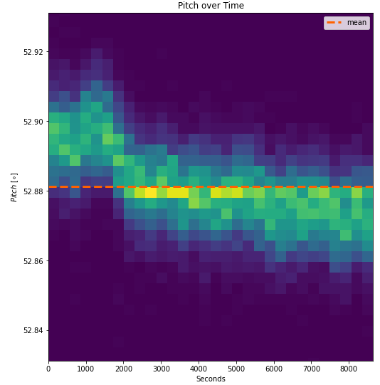

Heading is filtered with a simple IIR-Filter (decay=0.7):

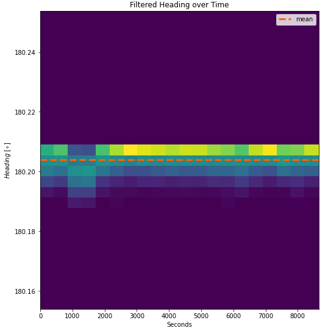

I'm really happy with the stationary precision and overall noise level.

Details about these test-results can be found in the [jupyter-lab notebook](docs/heading-pitch-longterm.ipynb) 

## Parts List

Part | Description | Datasheet | Price | Source
---|---|---|---|--
ESP32 DEVKIT V1 30-pin | Microcontroller | [ESP-WROOM-32 (30P)](https://github.com/TronixLab/DOIT_ESP32_DevKit-v1_30P) | <10€ | eBay
GP-20U7 | GPS-Receiver | [GP-20U7_Datasheet_v1 2.pdf](docs/GP-20U7_Datasheet_v1_2.pdf) | ~22€ | [Sparkfun](https://www.sparkfun.com/products/13740), [Berrybase](https://www.berrybase.de/en/audio-video/navigation/gps-empf-228-nger-gp-20u7-56-kan-228-le)
LSM6DSOX 6 DoF | Motion Sensor | [LSM6DSOX Datasheet](docs/lsm6dsox.pdf) | 12€ | [Berrybase](https://www.berrybase.de/en/sensors-modules/motion-distance/adafruit-lsm6dsox-6-dof-beschleugnigunssensor-und-gyroskop)
SD-Card Case | Housing for Motion Sensor | n/a | n/a | you will have one of these lying around
AMT222B-V | Angle Sensor | [AMT22-V Kit ](https://www.cuidevices.com/product/motion/rotary-encoders/absolute/modular/amt22-v-kit) | 50€ | [Mouser](https://eu.mouser.com/ProductDetail/CUI-Devices/AMT222B-V?qs=l7cgNqFNU1jQeqcgztT9Sw%3D%3D)
Molex 502578-0600 | Crimp-Housing for AMT22 | [CLIK-Mate Plug Housing](https://www.molex.com/molex/products/part-detail/crimp_housings/5025780600) | <1€ | [Mouser](https://eu.mouser.com/ProductDetail/Molex/502578-0600?qs=3OKVfsn1b5Ax%252B4TT0aiBNw%3D%3D)
Molex 79758-1011 | Cable Assembly for Crimp-Housing | [Pre-Crimped Lead CLIK-Mate](https://www.molex.com/molex/products/part-detail/cable_assemblies/0797581011) | 1€ | [Farnell](https://de.farnell.com/en-DE/molex/79758-1011/cable-assy-crimp-skt-skt-black/dp/3107351?CMP=i-ddd7-00001003)
Housing Raspberry Pi Zero | Housing for µC and GPS-Receiver | n/a | 4€ | [Berrybase](https://www.berrybase.de/en/raspberry-pi/raspberry-pi-computer/housing/for-raspberry-pi-zero/geh-228-use-gpio-referenz-f-252-r-raspberry-pi-zero?c=314)
SparkFun Qwiic 500mm | Connector Cable | [Flexible Qwiic Cable - 500mm](https://www.sparkfun.com/products/17257) | 2€ | [Sparkfun](https://www.sparkfun.com/products/17257), [Berrybase](https://www.berrybase.de/en/sensors-modules/adafruit-stemma-qt-sparkfun-qwiic/cables/sparkfun-qwiic-flexibles-kabel-500mm)
Micro-USB Cable | Power Supply | n/a | <5€ | Amazon
USB-Power Bank | Power Supply | n/a | 15€+ | Amazon
Hook/Loop Fastener with Adhesive | Attach housings to telescope base | n/a | 5€ | Hardware store
Teflon Sealant Tape | Reduce tolerances | n/a | <5€ | Hardware Store
POM Plastic Sheet 6mm | Attach Angle Sensor | n/a | 10€ | Hardware Store
Steel Rod 25mm diameter | Attach Angle Sensor | n/a | 20€ | Hardware Store
various Fasteners | Parts assembly | n/a | <10€ | Hardware Store

## Hardware Setup

## Mechanical Construction

A FeeCAD-File is available in the `cad`-folder. The following parts need to be manufactured:

Part | Description | Drawing
---|---|---
Sensor Plate | The plate is attached to the center of the upper base plate of the dobsonian. The 25mm hole holds the flange of the bolt. The angle sensor is then centered over the bolt and attached to the sensor plate. | 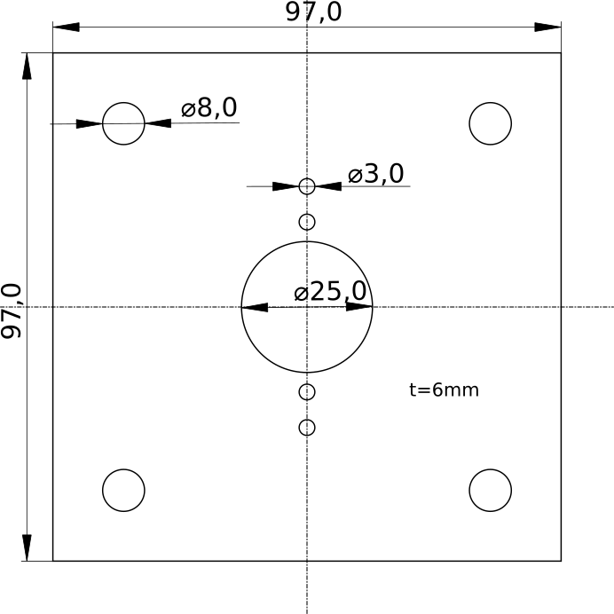
Bolt | Holds the upper and lower plate together. Holding fixture for the angle sensor rotor. The long part needs an M10 thread for a self-locking nut.| 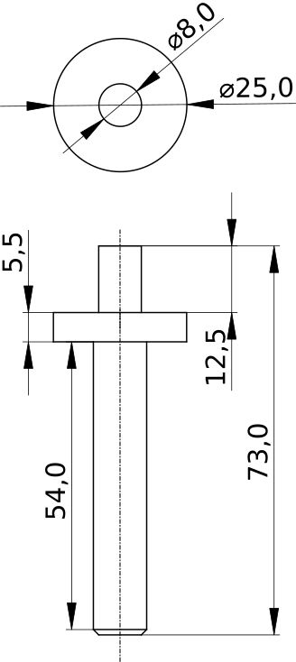
Clamp | Attaches the bolt to the lower base plate. The hex-cutout goes over the self-locking-nut. | 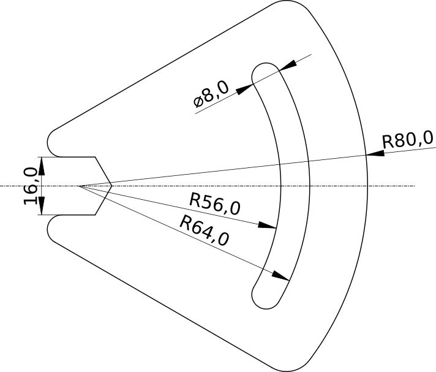

## Software

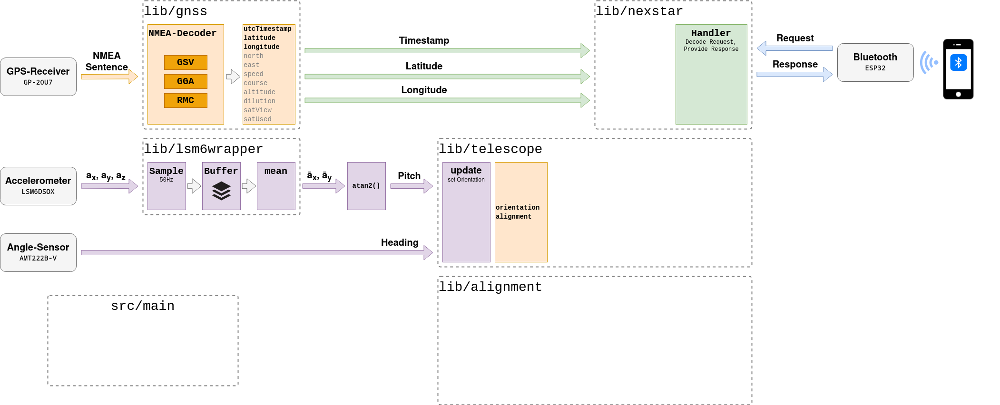

## Telescope Alignment

As the telescope's orientation after installation, especially with the more mobile dobsonians, is likely to deviate from the ideal horizontal/vertical orientation and to compensate for sensor-offset in general, an alignment-step is needed before use.

The aligment method is based on the alignment models described by [THE EQMOD PROJECT - DOCUMENTATION & FAQs ](http://eq-mod.sourceforge.net/tutindex.html). To allow for maximum flexibility and precision, I implemented the following methods and algorithms:

- 1-point alignment for a real quick setup
- 2-point alignment to compensate for rotation errors
- n-point aligment with triangulated areas and automatic nearest triangle selection

The software picks the best method automatically, depending on the number of available alignment points.

For each alignment method, one (or multiple) transformation matrices are calculated using [2D affine transformations](https://medium.com/hipster-color-science/computing-2d-affine-transformations-using-only-matrix-multiplication-2ccb31b52181).

### Alignment Guide

Alignment is done by pointing the telescope to a know target (e.g. star) and sending the real position of that target to the control unit. This is usually done with the telescope control feature of [Stellarium Plus](https://www.stellarium-labs.com/stellarium-mobile-plus/).

### 1-Point-Alignment

Consider a simple example where the telescope is pointed at a target (like, a star) and the sensor output indicates that the position of that target is $\mathbf{S}_1$. We know that, based on our current location and time, the target should be at the reference position $\mathbf{R}_1$.

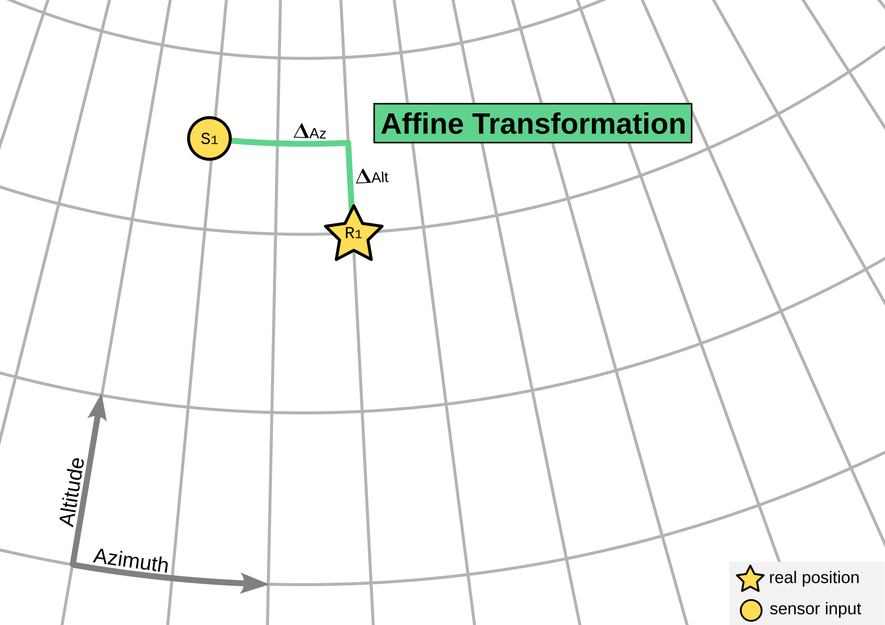

We can then calculate the difference $\Delta_{Az}$ and $\Delta_{Alt}$ and use these values to transform any given sensor input to it's real position:

$$\begin{pmatrix}
         R_{Az}\\
         R_{Alt} 
     \end{pmatrix} =
\begin{pmatrix}
         S_{Az} + \Delta_{Az} \\
         S_{Alt} + \Delta_{Alt}
     \end{pmatrix}
$$

This simple method clearly has it's limitations as it can't compensate for rotation and scale errors. To overcome this limitation, additional alignment points need to be added.

### 3-Point-Alignment

With 3 alignment points, we can draw lines between the sensor positions $\mathbf{S}_n$ resulting in a triangle. We can do the same with the real positions $\mathbf{R}_n$ and get another triangle. 

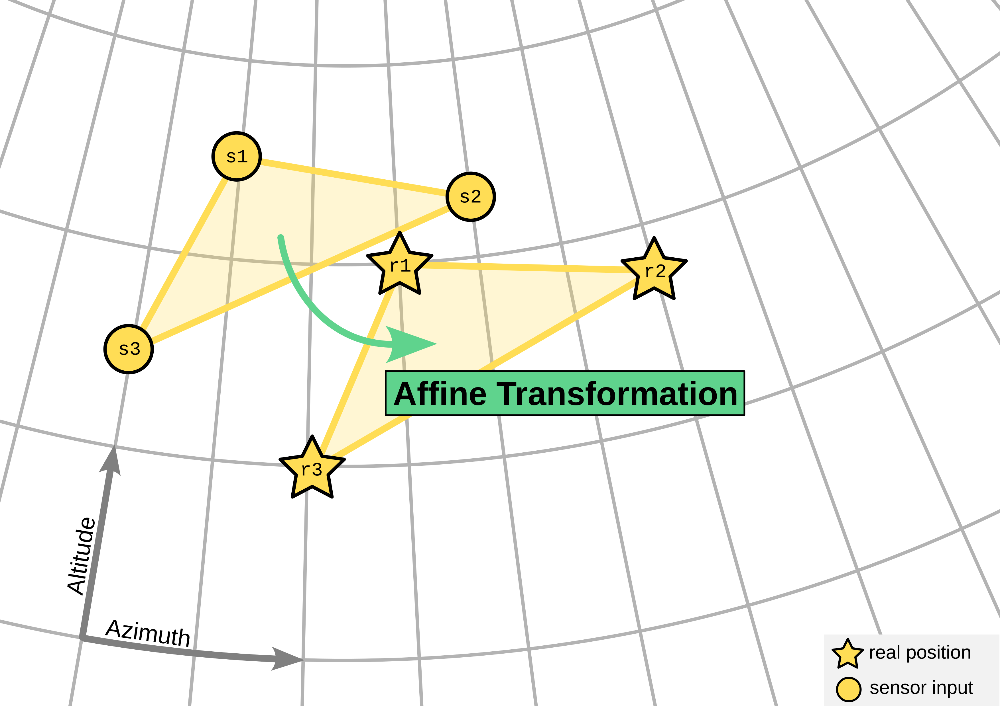

We can then calculate the affine transformation matrix $\mathbf{M}$ between the two triangles as follows:

$$\begin{aligned}
\mathbf{M} &= \mathbf{R} \times \mathbf{S}^{-1} \\
&= \begin{bmatrix}
         R_{1_{Az}} & R_{2_{Az}} & R_{3_{Az}}\\
         R_{1_{Alt}} & R_{2_{Alt}} & R_{3_{Alt}}\\
         1 & 1 & 1
     \end{bmatrix} \times
    \begin{bmatrix}
         S_{1_{Az}} & S_{2_{Az}} & S_{3_{Az}}\\
         S_{1_{Alt}} & S_{2_{Alt}} & S_{3_{Alt}}\\
         1 & 1 & 1
     \end{bmatrix}^{-1}
\end{aligned}$$

> Please note that in order to do the actual matrix calculations, we have to add a 3rd dimension ($z=1$) to each point.

We can then apply this transformation to any measured point $\mathbf{P}_S$ within the sensor input triangle to obtain the actual position $\mathbf{A}$ :

$$\begin{aligned}
\mathbf{A} &= \mathbf{M} \times \mathbf{P}\_S\\
\begin{pmatrix}
         A_{Az}\\
         A_{Alt}\\ 
         A_z 
     \end{pmatrix} &=      
    \begin{bmatrix}
         M_{11} & M_{12} & M_{13}\\
         M_{21} & M_{22} & M_{23}\\ 
         M_{31} & M_{32} & M_{33} 
     \end{bmatrix} 
     \times 
    \begin{pmatrix}
         P_{Az}\\
         P_{Alt}\\ 
         1 
     \end{pmatrix}
\end{aligned}$$

> $A_z$ can be ignored. We only need $A_{Az}$ and $A_{Alt}$.

This method can also be applied to points outside the alignment triangle but the precision will likely decrease with the distance to the triangle.

Solution? More alignment points!

### n-Point-Alignment

Adding more alignment points will give a better coverage of the sky but leads to another set of problems: 

1. New alignment points lead to new triangles.
2. Triangles might overlap.
3. Each triangle-pair (Sensor and Reference) can have it's own specific transformation matrix.

The solution to this is triangulation. We add all alignment points to an array and compute the resulting set of triangles using a [triangulation algorithm](http://paulbourke.net/papers/triangulate/). Whenever a sensor input needs to be transformed to the real position, we execute the following steps:

1. select the nearest triangle $T$ in our set of reference triangles.
2. use the triangle's specific transformation matrix $\mathbf{M}_T$, to calculate the real position

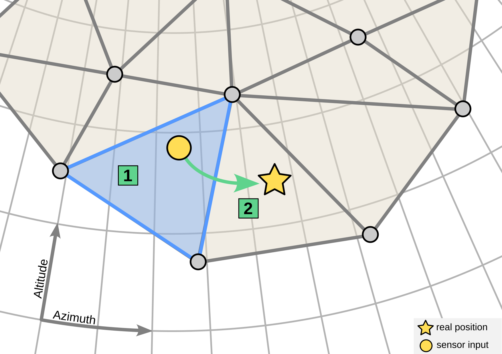

The actual horizontal position $\mathbf{A}$ is then derived from the sensor input $\mathbf{P}_S$ and the transformation matrix $\mathbf{M}_T$ as follows:

$$\mathbf{A} = \mathbf{M}_T \times \mathbf{P}_S$$

## User Interface

## Known Issues and Limitations

- Alignment near the zenith does not work very well due to the properties of the horizontal (Az-Alt) coordinate system.

## References

I used a lot of resources on the internet during this project. Here's a list of the most important:

### Similar Projects

- [vlaate/DobsonianDSC](https://github.com/vlaate/DobsonianDSC)
- [Control Your Telescope Using Stellarium & Arduino](https://www.instructables.com/Control-Your-Telescope-Using-Stellarium-Arduino/)
- [Arduino Star-Finder for Telescopes](https://www.instructables.com/Arduino-Star-Finder-for-Telescopes/)
- [SpotNik - StepTo / PushTo / Digital Setting Circles for EQ Mounted Telescopes Based on Arduino](https://www.instructables.com/SpotNik-StepTo-PushTo-Digital-Setting-Circles-for-/)
- [Instrumented Telescope with Raspberry Pi and orientation sensor](https://astrobeano.blogspot.com/2014/01/instrumented-telescope-with-raspberry.html)
- [Telescope pointing based on inertial measurement unit](http://www.doiserbia.nb.rs/Article.aspx?ID=1450-698X1794101V)
- [Accurate Telescope Mount Positioning with MEMS Accelerometers](https://arxiv.org/abs/1407.0035)

### Math

- [Calculating mean and apparent sidereal time](http://www2.arnes.si/~gljsentvid10/sidereal.htm)
- [Data: Converting Alt-Az to RA-Dec – Example](http://jonvoisey.net/blog/2018/07/data-converting-alt-az-to-ra-dec-example/)
- [International Astronomical Union Standards of Fundamental Astronomy](http://www.iausofa.org/)
- [The Astropy Project](https://www.astropy.org/)
- [Astronomical Calculations: Sidereal Time](https://squarewidget.com/astronomical-calculations-sidereal-time/)
- [Sidereal Time Calculator For Any Date, Time and Longitude](http://www.neoprogrammics.com/sidereal_time_calculator/index.php)
- [Local Sidereal Time](https://www.localsiderealtime.com/)
- [Sidereal time calculator](https://astro.subhashbose.com/siderealtime)
- [Converting RA and DEC to ALT and AZ](http://www.stargazing.net/kepler/altaz.html)
- [3D Rotation Converter](https://www.andre-gaschler.com/rotationconverter/)
- [THE EQMOD PROJECT - DOCUMENTATION & FAQs ](http://eq-mod.sourceforge.net/tutindex.html)
- [How to find a transformation matrix, given coordinates of two triangles in R2](https://math.stackexchange.com/questions/557507/how-to-find-a-transformation-matrix-given-coordinates-of-two-triangles-in-r2)
- [Computing 2D affine transformations using only matrix multiplication](https://medium.com/hipster-color-science/computing-2d-affine-transformations-using-only-matrix-multiplication-2ccb31b52181)
- [Learn How to Write Markdown & LaTeX in The Jupyter Notebook](https://towardsdatascience.com/write-markdown-latex-in-the-jupyter-notebook-10985edb91fd)
- [tomstewart89/BasicLinearAlgebra](https://github.com/tomstewart89/BasicLinearAlgebra)
- [Efficient Triangulation Algorithm Suitable for Terrain Modelling, Paul Bourke, 1989](http://paulbourke.net/papers/triangulate/)
- [Use Markdown to display mathematical expressions on GitHub](https://docs.github.com/en/get-started/writing-on-github/working-with-advanced-formatting/writing-mathematical-expressions)
- [FIIIR! - Design FIR & IIR Filters](https://fiiir.com/)

### Orientation Sensor

- [Bosch Sensortec MEMS BNO055 sensor driver](https://github.com/BoschSensortec/BNO055_driver)
- [AltIMU-AHRS](https://github.com/jremington/AltIMU-AHRS)
- [Using an Accelerometer for Inclination Sensing](https://www.analog.com/en/app-notes/an-1057.html)

### GPS, GNSS, NMEA

- [GPS - NMEA sentence information](http://aprs.gids.nl/nmea/)
- [Common NMEA Sentences](http://www.satsleuth.com/GPS_NMEA_sentences.aspx)

### Hardware

- [Comparing Gyroscope Datasheets](https://learn.adafruit.com/comparing-gyroscope-datasheets)
- [DOIT ESP32 DevKit-v1 (30P)](https://github.com/TronixLab/DOIT_ESP32_DevKit-v1_30P)

### ESP32 Programming

- [How to format strings without the String class](https://cpp4arduino.com/2020/02/07/how-to-format-strings-without-the-string-class.html)
- [C++ Core Guidelines](http://isocpp.github.io/CppCoreGuidelines/CppCoreGuidelines)
- [ESP32: Getting started with Bluetooth](https://www.electrosoftcloud.com/en/esp32-getting-started-with-bluetooth/)
- [ESP32 Arduino Tutorial: 38. Serial over Bluetooth - Client connection event](https://www.dfrobot.com/blog-1203.html)

### Stellarium

- [RemoteControl plugin HTTP API description ](http://stellarium.org/doc/head/remoteControlApi.html)
- [Telescope Control plug-in](http://stellarium.sourceforge.net/wiki/index.php/Telescope_Control_plug-in)
- [NexStar Communication Protocol v 1.2](https://www.celestron.com/pages/manuals)

### Astronomy related

- [Light pollution map](https://www.lightpollutionmap.info/)
- [NexStar Resource Site](https://www.nexstarsite.com/index.html)
